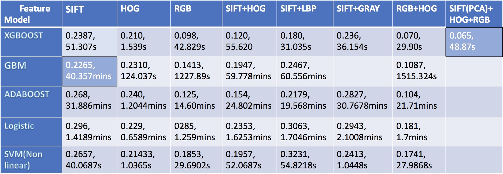

# Project: Dogs, Fried Chicken or Blueberry Muffins?


### [Full Project Description](doc/project3_desc.md)

Link: https://prezi.com/dxbkmyxohzxs/

Term: Spring 2018

+ Team 2
+ Team members
	+ Ziyu Chen
	+ Du Guo
	+ Tao Guo
	+ Xiaoxiao Guo
	+ Yuehan Kong

+ Project summary: In this project, we created a classification engine for images of dogs versus fried chicken versus blueberry muffins. Our baseline model is gbm with sift feature. Then, we tried hog, rgb, sift + hog, sift + lbp, sift + grey, rgb + hog, sift (PC) + rgb + hog eight kinds of features and choose sift (PC) + rgb + hog as the final feature. As for model, we tried gbm, adaBoost, xgBoost, logistic, svm (non-linear) these five models and choose xgBoost as the final model.  




	
**Contribution statement**: ([Team 2](doc/a_note_on_contributions.md)) 

Following [suggestions](http://nicercode.github.io/blog/2013-04-05-projects/) by [RICH FITZJOHN](http://nicercode.github.io/about/#Team) (@richfitz). This folder is orgarnized as follows.

```
proj/
├── lib/
├── data/
├── doc/
├── figs/
└── output/
```

Please see each subfolder for a README file.
